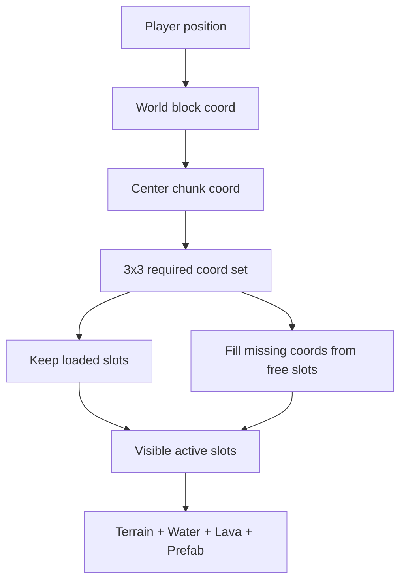

# 3×3 ChunkManager 设计确认

## 问题理解
当前实现是 `TerrainChunkPingPong`：只有 active slot 和 standby slot。它适合验证“跨边界前预生成一个目标 chunk”，但本质上只能服务一个预测方向。玩家如果斜向移动、贴角移动、快速转向，或者相机能看到当前 chunk 外的一圈区域，2-slot 都可能出现临时空窗或同步生成压力。

假设：
- 继续保持 chunk-local 渲染：每个 `ChunkRenderSlot` 内部只画自己的 terrain/water/lava/prefab。
- 继续复用 slot 内部的 `InstancedMesh` 和 prefab buckets。
- 不做无限远缓存，也不做复杂 LOD；这一步只解决玩家周围稳定加载范围。

## 为什么选择 3×3 Active Window
3×3 是二维移动里“当前 chunk + 四边邻居 + 四个角邻居”的最小完整邻域。

它比 2-slot 稳定，因为：
- 横向、纵向、斜向移动都已有目标 chunk。
- 玩家站在 chunk 角附近时，四个可能方向都不会依赖临时预测。
- 相机跟随飞机时，视野通常不只覆盖当前 chunk；周围一圈能避免边缘突然生成。
- 资源上限固定为 9 个 slot，仍然简单可控。

它比 5×5 更合适作为下一步，因为：
- 9 个 chunk 已经能覆盖“当前邻域”的核心问题。
- 25 个 chunk 会把 terrain、water、lava、prefab 实例容量同时放大，当前还没有性能数据支持。
- 3×3 的管理逻辑足够暴露 ChunkManager 需要的生命周期问题，但不会一次引入 LOD、远距离卸载、异步任务队列等复杂度。

## 推荐方案
新增 `ChunkManager`，替代 `TerrainChunkPingPong` 的职责。`ChunkRenderSlot` 保持不变，继续作为单个 chunk 的渲染容器。

核心职责：
- 根据玩家位置计算 center chunk。
- 计算 center 周围 radius=1 的 3×3 required coords。
- 保留仍在 required coords 内的 slot。
- 从空闲 slot 池中拿 slot 填充新增 coords。
- 超出窗口的 slot 隐藏并放回空闲池，等待复用。
- 对外提供和当前类似的 `bootstrap()`、`update()`、`refreshAOPreview()`、`getDebugMaterials()`、`dispose()`。

数据结构：
- `activeSlots: Map<chunkKey, ChunkRenderSlot>`：当前 3×3 可见 slot。
- `freeSlots: ChunkRenderSlot[]`：可复用但当前不显示的 slot。
- `slots: ChunkRenderSlot[]`：固定创建 9 个 slot。
- `centerCoord`：玩家当前所在 chunk。

## Slot 规格与资源预算
当前配置是 `chunks.size: 72`、`chunks.halo: 1`、`terrain.cellSize: 0.2`。

单个 `ChunkRenderSlot` 的规格：
- 可见逻辑尺寸：`72 × 72` terrain cells，即 `5184` 个地表采样格。
- 采样尺寸：`(72 + halo * 2) × (72 + halo * 2)`，当前是 `74 × 74`。halo 只用于高度、法线感、AO、邻居高度、边缘衔接等采样，不直接渲染成可见 chunk 宽度。
- 世界尺寸：`72 * 0.2 = 14.4` world units，所以 3×3 active window 覆盖约 `43.2 × 43.2` world units。
- 每个 slot 包含一整套 renderer：terrain、water、lava、prefab placer、heightfield AO。

3×3 active window 的固定上限：
- slot 数：`9`，不随移动增长。
- 可见地表格：`9 * 5184 = 46656` cells。
- 采样图总量：`9 * 74 * 74 = 49284` samples。
- terrain 实例数：由 `LayeredTerrainBuilder.buildPlacements()` 动态决定，受地形高度、邻居暴露面、水和 lava 挖空影响。它不是固定 `cells * maxHeight`，但最坏成本与 chunk 面积和垂直暴露层数相关。
- water/lava 实例数：每 slot 动态扩容，容量按当前 chunk 实际 water/lava cell 数的 `1.2` 倍增长并复用。
- prefab 实例数：每 slot、每 prefab bucket 固定容量，见下一节。

这个规格意味着 3×3 不是只把 terrain 乘 9，而是把 terrain、water、lava、AO、prefab bucket 都乘到最多 9 份。因此实现时必须避免每次移动创建新 renderer；只能重填复用的 9 个 slot。

## Prefab Capacity 策略
当前 `PrefabPlacer` 的 `prefabCapacity` 是 `getPrefabCapacity(prefabEntry)` 返回的每个 category 容量，并在 `fillTransformBucket()` 中用于单个 `InstancedMesh` bucket：

```81:86:src/world/prefabs/PrefabPlacer.js
const capacity = this.getPrefabCapacity(prefabEntry)
const instanceCount = Math.min(transforms.length, capacity)
```

在 chunk 架构下，每个 `ChunkRenderSlot` 都有自己的 `PrefabPlacer`。因此 `prefabCapacity` 的实际含义应明确为：

- 不是全世界容量。
- 不是整个 3×3 window 共享容量。
- 是“单个 slot 内，单个 prefab category/bucket 的容量上限”。

所以不应该因为 9 slots 就把 `prefabCapacity` 简单乘以 9。那会把单窗口最坏 GPU instance buffer 放大到 `9 × 新容量`，很容易过量。

推荐先保持当前数值不变，把它解释为 per-slot cap：
- `tree: 128`
- `flora: 512`
- `rock: 256`
- `plant: 256`
- `waterAccent: 32`
- `waterPlant: 64`
- `prop: 64`

理由：
- 当前一个 slot 是 `72 × 72 = 5184` cells，小于旧静态世界 `128 × 128 = 16384` cells。
- 9 个 slot 的总覆盖面积更大，但每个 slot 独立裁剪，单 slot bucket 不需要装下整个窗口的实例。
- `PrefabPlacer` 已经有 overflow warning；如果某类 prefab 在单 chunk 内溢出，应调该 category 的 per-slot cap，而不是按 active window 统一放大。

需要新增测试和诊断：
- 测试 `prefabCapacity` 在 `ChunkManager` 下仍是 per-slot cap。
- 测试 9 slots 中每个 slot 的 bucket 独立计数，不共享、不串块。
- 保留 overflow warning，用它作为后续调参依据。
- 如果调试时发现 flora 高频溢出，优先只提高 `flora` 的 per-slot cap；不要改 `tree/rock/prop`。

## Terrain / Water / Lava Capacity 策略
terrain、水、lava 当前不是配置固定 cap，而是 renderer 在 `build()` 时按实际实例数扩容到 `ceil(count * 1.2)` 并复用 mesh。

在 3×3 中推荐保持这个策略：
- 每个 slot 初次填充时按自己的实际实例数创建 mesh。
- 后续同一个 slot 被复用到新 coord，如果新 count 小于等于历史 capacity，只更新 `mesh.count` 和 instance matrix。
- 如果新 count 超过历史 capacity，只扩容该 slot 的该 renderer，不影响其他 8 个 slot。

这比预先给 terrain/water/lava 配全局固定容量简单，也更符合当前代码。

需要注意：3×3 bootstrap 会一次生成 9 个 chunk，首次成本明显高于 2-slot。为了先保持实现简单，这一版仍同步生成；如果浏览器实测卡顿，再加分帧填充或优先中心 chunk。

数据流：


## Alternative Options Considered
Option A: keep 2-slot ping-pong and add more prefetch directions. This stays cheaper, but quickly becomes edge-case logic: corners need diagonal prefetch, sudden direction changes invalidate the single standby slot, and visibility is still not stable around the player.

Option B: jump to 5×5 or distance-based cache. This is more future-proof, but over-scales the problem before we have profiling data. It also encourages adding eviction policies, prioritization, and async generation too early.

Option C: implement 3×3 fixed active window. This is the simplest complete 2D streaming model, keeps memory bounded, and reuses the slot architecture already built. This is the recommended next step.

## Concrete File Scope
- `src/world/chunks/ChunkManager.js`: new manager, likely replacing `TerrainChunkPingPong` for runtime use.
- `src/world/chunks/chunkCoordinates.js`: add helper for `getChunkWindowCoords(centerCoord, radius)` and stable key ordering.
- `src/world/world.js`: instantiate `ChunkManager` when `chunks.enabled` is true.
- `src/world/WorldConfig.js`: add `chunks.windowRadius: 1` or `chunks.activeWindow: 3`; recommend `windowRadius: 1` because it generalizes naturally while still defaulting to 3×3.
- Tests: add `test/chunkManager.test.js`; keep existing ping-pong tests only if the old class remains.

## Testing Plan
- Unit test 3×3 coord generation, including negative chunk coords.
- Bootstrap loads exactly 9 visible slots around center.
- Moving one chunk reuses overlapping slots and only repopulates the newly exposed strip.
- Moving diagonally reuses the 2×2 overlap and fills the opposite 5 chunks.
- Slot count stays fixed at 9; no extra `ChunkRenderSlot` creation after bootstrap.
- AO preview hides/restores overlays across all visible slots.
- Water/lava/prefab remain chunk-local in managed slots.