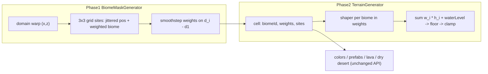

# 程序化 Biome 生成 + 按 Biome 区分地貌（两阶段）

## 问题与决策
- 现状：[src/world/biomes/BiomeMaskGenerator.js](src/world/biomes/BiomeMaskGenerator.js) 只认 [WorldConfig.js](src/world/WorldConfig.js) 里手动配置的 4 个圆形 `regions`（半径 120，彼此相距 400），其余区域全部默认为 forest。由于 region 互不重叠，边缘的 weights 会从 `{volcano: 1}` 直接跳到 `{forest: 1}`，再加上 `heightOffset` / `heightMagnitude` 的差异，就形成了断崖。在“生态决定地形”的设计下，biome 分布本身就是地形的输入，所以必须先把 biome 生成做对。
- 已确认的决策：
  - biome 生成采用 Jittered Voronoi。
  - `heightOffset` / `heightMagnitude` 与 shaper 设计冲突，直接删除，不保留兼容。
  - 一份计划，分两个阶段执行。
- 前提：`BiomeCenterSystem` 在工作区中已被删除，所以不需要保留固定的 region 中心点。



## 阶段 1：程序化 Biome 生成

1. **重写 [src/world/biomes/BiomeMaskGenerator.js](src/world/biomes/BiomeMaskGenerator.js)**，`generate` 和 `generateForBounds` 的接口保持不变：
   - 站点：世界被划分为边长 `cellSize` 的网格，网格坐标 `(gx, gz)` 用 [src/utils/random.js](src/utils/random.js) 的 `random01(gx, gz, seed + k)` 生成：
     - 站点位置：`((gx + 0.5 + (r1 - 0.5) * jitter) * cellSize, ...)`。
     - 站点 biome：`pickWeighted(table, r3)`。
     - 如果 `originBiome` 有值，则 `(0, 0)` 所在网格强制使用该 biome，从而保留“出生点是 autumnForest”的现有设定。
   - 采样：先对 `(x, z)` 做低频 domain warp（使用 `createNoise2D(mulberry32(seed + offset))`，振幅为 `warp`），避免 Voronoi 出现直线多边形边界。然后遍历 3x3 邻域网格的站点，求出各站点的距离 `d_i` 和最小距离 `d1`。
   - 权重：`w_i = smoothstep(1, 0, (d_i - d1) / blendWidth)`，按 biome id 累加后归一化。距离差超过 `blendWidth` 的站点权重自然为 0，所以结果很稀疏，并且在三岔口等任何位置都连续，不会因为 top-2 截断而跳变。
   - 输出：`{ biomeId, weights, sites: { [biomeId]: { x, z, distance } } }`。`sites` 里每个 biome 只保留距离最近的那个站点，供阶段 2 的火山锥等需要中心点的 shaper 使用。
   - 噪声实例按 seed 缓存，seed 改变时重建，与 `TerrainGenerator` 每次生成都重新创建 noise 的方式保持一致。
2. **[src/world/WorldConfig.js](src/world/WorldConfig.js)**：删除 `biomes.regions`，改为：

```js
biomes: {
  cellSize: 192,
  jitter: 0.6,
  blendWidth: 24,
  warp: { amplitude: 40, scale: 160 },
  originBiome: 'autumnForest',
  table: [
    { id: 'forest', weight: 4 },
    { id: 'autumnForest', weight: 3 },
    { id: 'desert', weight: 2 },
    { id: 'volcano', weight: 1 }
  ]
}
```

3. **[src/debug/panels/BiomePanel.js](src/debug/panels/BiomePanel.js)**：去掉 region radius 的绑定，改为绑定 `cellSize`、`jitter`、`blendWidth`、`warp.amplitude` 以及 `table[i].weight`。
4. 下游调用方的 API 不变：`placementRules` 读取的 `biomeId`、`BrickColorResolver` 的抖动配色、Volcano 和 Desert 表面特征使用的 `weights.volcano` / `weights.desert` 都可以直接沿用。这个阶段仍然保留旧的 `heightOffset` / `heightMagnitude` 混合，所以可以单独验证：biome 分布正确，且边界的权重是连续过渡的。

## 阶段 2：Terrain Shapers

1. **新建 [src/world/terrain/heightShapers.js](src/world/terrain/heightShapers.js)**：
   - 把 `sampleHeightCurve` 和 `fbm(noise2D, x, z, noise)` 从 `TerrainGenerator` 迁过来，避免循环引用；[test/terrainHeightCurve.test.js](test/terrainHeightCurve.test.js) 的 import 路径同步修改。
   - 统一签名：`shaper({ x, z, noise2D, terrain, params, site }) -> 相对 waterLevel 的高度（层，浮点）`。每个 shaper 自己决定高度范围，没有任何通用的 offset 或 magnitude。
   - 各 shaper 通过对坐标加固定偏移来获得互不相关的噪声。`noise` 参数允许每个 biome 单独覆盖，未覆盖的部分使用 `config.terrain.noise*` 作为默认值。
   - `terraced`：`sampleHeightCurve(params.heightCurve, fbm01)`。曲线的 h 值直接写成绝对层数。
   - `dunes`：低频 fbm 作为底座，叠加沿 `windAngle` 方向拉伸的 ridged 噪声 `1 - |n|`。
   - `volcano`：用 `site.distance` 生成锥体 `(1 - d / coneRadius)^power * peak`，在 `craterRadius` 范围内挖出火山口，叠加 fbm 增加粗糙感，再按 `terraceStep` 量化；`d > coneRadius` 的部分使用低矮的 terraced 基底。
2. **[src/world/terrain/TerrainGenerator.js](src/world/terrain/TerrainGenerator.js)**：
   - 保存 `biomeRegistry`。
   - `writeHeightSample` 改为 `h = waterLevel + sum(w_i * shaper_i(...))`，然后 floor 并 clamp。
   - 删除类内的 `fbm`。
   - 阶段 1 的权重已经保证连续，因此不再需要“边缘向 forest 渐变”这类补丁逻辑。
3. **删除旧设计的残留**：
   - [BiomeBlender.js](src/world/biomes/BiomeBlender.js) 的 `blendTerrainParam`：唯一的调用方被移除，一并删除。
   - 4 个 biome 定义中的 `terrain.heightOffset` / `terrain.heightMagnitude`：改为 `terrain.shape`。
   - [WorldConfig.js](src/world/WorldConfig.js) 的全局 `terrain.heightCurve`：迁入 forest 的 `shape.heightCurve`，h 值按原来的 `0.95` 倍预先换算好。
   - [TerrainPanel.js](src/debug/panels/TerrainPanel.js) 的 Height curve 面板：删除。
4. **各 biome 的 shape 设置**：
   - forest：`terraced`，沿用现有台阶地形。
   - autumnForest：`terraced`，台阶更多、每级更矮，呈连绵丘陵。
   - desert：`dunes`。
   - volcano：`volcano`，`coneRadius` 取约 70，需要小于 `cellSize * (1 - jitter) / 2 + blendWidth` 这个量级，保证锥体基本落在自己的 Voronoi cell 里。

## 验证
- 阶段 1：新增 [test/biomeMask.test.js](test/biomeMask.test.js)，覆盖以下几点：
  - 确定性：同一坐标从不同 chunk origin 生成，结果相同。
  - 每个 cell 的权重之和为 1。
  - 边界连续：沿一条穿过边界的直线，相邻格子的权重差不超过某个上限。
  - `originBiome` 生效。
  - 在大范围采样时，各 biome 的占比与 `table` 设定的比例大致相符。
  - 同时更新 [test/terrainChunkPingPong.test.js](test/terrainChunkPingPong.test.js) 中的 `biomes` 配置。
- 阶段 2：新增 [test/heightShapers.test.js](test/heightShapers.test.js)，覆盖：
  - forest 的 terraced 输出与旧公式等价。
  - 火山剖面：火山口中心 < 火山口边缘，且火山口边缘 > 锥体外缘。
  - 跨 biome 边界相邻格子的高度差保持在小范围内。
- 每个阶段结束后运行 `pnpm test`，再用 `pnpm dev` 实际查看。阶段 1 看 biome 分布和边界上的抖动配色；阶段 2 看沙丘、火山锥，以及边界是否还有断崖，并重点检查：
  - 火山坡度变陡后，lava 的 `maxSlope: 4` 和 `volcanoRock` 的 `maxSlope: 3` 是否让熔岩和岩石明显变少。
  - 沙漠 prefab 的 `maxSlope` 设置下，物件能否放在沙丘上。
  - 出生点附近的地形是否还适合起飞。
