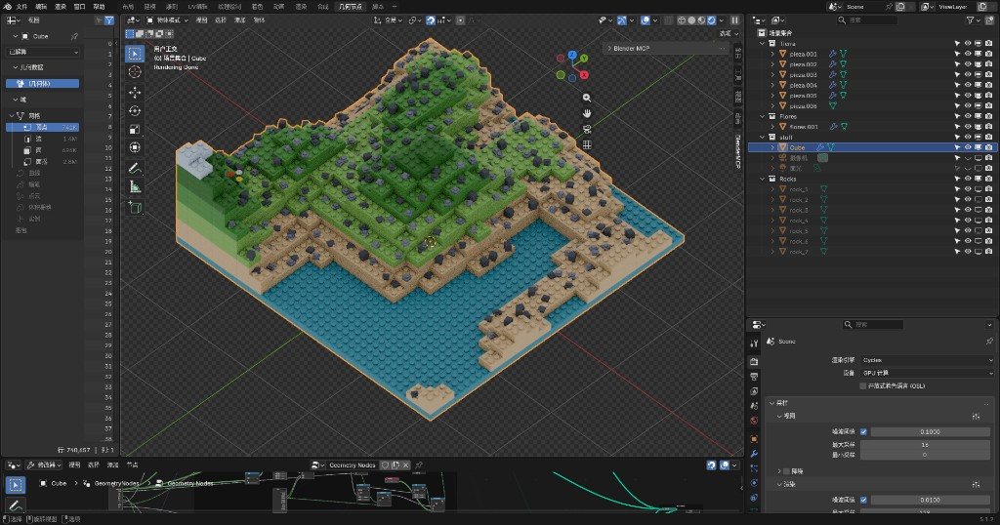

# 程序化地形 Geometry Nodes 实现思路

> 来源：Blender 场景 `stuff` 集合下的 `Cube` 网格，修改器 `GeometryNodes`，节点组 `Geometry Nodes`（共 70 个节点）。
> 通过 Blender MCP 读取节点树结构、连接与参数后整理。



## 1. 总体概览

这是一个**体素/低多边形分层台地（terraced voxel）风格的程序化地形生成器**。核心思路：

1. 用一张 **栅格（Grid）** 作为地形的平面采样网格。
2. 用 **4D 噪声** 给每个栅格点算出一个"高度层数"。
3. 用 **复制元素（Duplicate Elements）** 把栅格按层数堆叠成阶梯状台地，每一层沿 Z 抬高一个固定层间距。
4. 在每个格点上 **实例化 `Tierra` 集合中的方块瓦片**，并根据"所在层高 / 是否低于水面"切换不同瓦片（草、土、沙、水）。
5. 在地形**顶面**再撒点，按噪声遮罩在水面之上分别实例化 **花朵（`Flores`）** 与 **岩石（`Rocks`）**。
6. 最终 `合并几何` + `实现实例` 输出。

整个图按阶段用 Frame 分组（节点名前缀即执行阶段）：

| 阶段 | Frame 名称 | 职责 |
|------|-----------|------|
| 10 | Terrain Generation | 栅格 → 噪声高度 → 分层堆叠 → 瓦片实例化 |
| 20 | Vegetation Candidate Points | 取地形顶面候选点（含滚动/平铺包裹） |
| 30 | Vegetation Base Mask | "高于水面"基础遮罩 |
| 40 | Flower Mask | 花朵随机遮罩 |
| 50 | Flower Instance | 花朵实例化 + 随机旋转/缩放 |
| 60 | Rock Mask | 岩石随机遮罩 |
| 70 | Rock Instance | 岩石实例化 + 随机种类/旋转 |
| 90 | Output | 合并几何 + 实现实例 |

## 2. 对外暴露参数（节点组接口）

| 参数 | 类型 | 默认值 | 作用 |
|------|------|--------|------|
| `chunkNum` | Int | 1 | 地块尺寸 + 网格分辨率（块数） |
| `层间距` | Float | 0.1 | 每一层台地沿 Z 抬高的步长 |
| `山体高度` | Int | 20 | 噪声映射后的最大层数（地形起伏强度） |
| `水面高度` | Int | 1 | 水面所在层高（低于此层用水瓦片） |
| `高度偏移` | Float | 0.0 | 高度偏移（预留） |
| `花朵密度` | Float | 0.55 | 花朵噪声筛选阈值 |
| `scroll` | Float | 0.0 | 地形/植被滚动偏移（可做无限滚动地图） |
| `Seed` | Int | 0 | 噪声随机种子 |
| `岩石密度` | Float | 0.08 | 岩石噪声筛选阈值 |

## 3. 分阶段实现细节

### 阶段 10：地形生成（核心）

**1) 构建采样网格**
- `栅格(Grid)`：`Size X/Y = chunkNum`；
- 顶点数：`顶点密度(MULTIPLY)`：`chunkNum × 5` → `顶点密度.001(ADD)`：`+1` → `Vertices X/Y = chunkNum*5 + 1`。
- 即分辨率随地块数线性增长，每块约 5 个细分。

**2) 计算每点的高度层数（噪声）**
- `位置(Position)` 与 `旋转合并XYZ.002`（来自 `scroll` 经 `对齐.002` SNAP 0.2 量化）相加 → 得到采样坐标（支持滚动偏移）。
- 送入 `噪声_数量(Noise Texture, 4D)`：`Scale=0.3, Detail=2, Roughness=0.5`，`W = Seed`。
- `映射范围(Map Range)`：`From [0.4, 1.0] → To [0, 1]`，把噪声拉伸并裁掉低值（制造平地/海洋）。
- `倍增相加(MULTIPLY_ADD)`：`噪声值 × 山体高度 + 水面高度` → 得到**该点的层数（高度）**。

**3) 堆叠成阶梯台地**
- `复制元素(Duplicate Elements, POINT 域)`：`Amount = 上一步层数`，把整张栅格复制 N 份。
- `高度倍增(MULTIPLY)`：`层间距 × Duplicate Index` → 每一份副本沿 Z 抬高 `index × 层间距`。
- `合并矢量 → 设置位置 Offset` → 形成阶梯状体素地形。

**4) 在格点上实例化地形瓦片**
- `设置位置` 输出的点 → `实例化于点上(Instance on Points)` 的 Points。
- `集合信息(Tierra)` 提供 6 个方块瓦片（`pieza.001~006`）作为实例源。
- **瓦片选择**由 `水位实例选择(Switch, INT)` 决定 `Instance Index`：
  - **False 分支（普通地形）**：`倍增相加.001`：`Duplicate Index × 0.35 + 0.65` → `编号钳制(CLAMP 0~5)`，即按层高选择不同瓦片（越高用越靠"草/顶"的瓦片）。
  - **True 分支（水下）**：`水块编号(Integer)` 固定的水面瓦片编号。
  - 切换条件 `水面层判断(COMPARE INT, LESS_THAN)`：`Duplicate Index < 水面高度` → 该层低于水面则用水瓦片。

> 这一段就是"草地高地 + 沙土过渡 + 蓝色水面"分层外观的来源。

### 阶段 20：植被候选点（顶面采样）

- 复用原始 `栅格` → `设置位置.002` → `设置位置.001` → `捕捉属性(Capture Attribute, POINT)`，得到与地形顶面对齐的撒点用网格。
- **位置包裹（无缝滚动）**：`矢量运算.001(SUBTRACT)` 减去滚动偏移，`矢量运算.003(WRAP)` 按地块尺寸（`运算 = chunkNum×0.5`，`运算.001 = chunkNum×0.5×-1`）把坐标 wrap 在地块范围内，实现可滚动/平铺地图。
- **贴合顶面高度**：`设置位置.001 Offset.Z = 倍增相加.002`：`FLOOR(地形层数) × 0.1(层间距)`，把植被吸附到台阶顶面。
- `捕捉属性` 把 `编号(Index)` 捕捉到点上，供后续白噪声按点取随机值。

### 阶段 30：基础遮罩（高于水面）

- `位置_花朵 → 分离XYZ → Z`，与 `水面阈值(MULTIPLY)`（`水面高度 × 0.12`）比较：
- `高于水面(COMPARE, GREATER_THAN)`：Z > 阈值 → 该点在水面之上。**花朵与岩石共用此遮罩**，保证只长在陆地上。

### 阶段 40 / 50：花朵

- **遮罩**：`白噪波纹理(White Noise, 按捕捉的 Index 取值)` → `噪声筛选(COMPARE, LESS_THAN 花朵密度)`；
  `花朵选中 = 高于水面 AND 噪声筛选` → 作为 `实例化花朵` 的 Selection。
- **实例**：`集合信息_花朵(Flores)` 作为实例源。
- **随机旋转**：`随机值(0~1, 按 Index 为 ID)` → `对齐(SNAP π/2)` → 量化成 90° 朝向。
- **随机缩放**：`随机缩放(0.5~1.0)` → `缩放步进(SNAP 0.1)` → 离散档位缩放，保持像素风统一感。

### 阶段 60 / 70：岩石

- **遮罩**：`岩石白噪波纹理 → 岩石噪声筛选(LESS_THAN 岩石密度 0.08)`；
  `岩石选中 = 高于水面 AND 岩石噪声筛选`。
- **实例**：`集合信息_岩石(Rocks)`，7 个岩石变体。
- **随机种类**：`随机岩石编号(INT 0~6, Seed=11)` → `Instance Index`。
- **随机旋转**：`随机岩石旋转Z(-π~π, Seed=23)` → Z 轴旋转。

### 阶段 90：输出

- `合并几何(Join Geometry)` 合并三路：地形瓦片实例、花朵实例、岩石实例。
- `实现实例(Realize Instances)` → `组输出 Geometry`。

## 4. 数据流主线（简化）

```
chunkNum ─→ 栅格(Grid) ─┬─→ 复制元素(按噪声层数堆叠) ─→ 设置位置(逐层抬高) ─→ 实例化瓦片(Tierra) ─┐
                        │        ▲                                   ▲(Switch: 水面/层高选瓦片)      │
Seed,scroll ─→ 噪声 ─→ 映射范围 ─→ 倍增相加(×山体高度+水面高度)                                       │
                        │                                                                          ├─→ 合并几何 ─→ 实现实例 ─→ 输出
                        └─→ 捕捉顶面候选点 ─→ 高于水面遮罩 ─┬─→ 花朵遮罩 ─→ 实例化花朵(Flores) ───────┤
                                                          └─→ 岩石遮罩 ─→ 实例化岩石(Rocks) ─────────┘
```

## 5. 关键设计要点 / 复刻提示

- **阶梯地形的本质**：不是位移顶点，而是用 `Duplicate Elements` 把平面网格复制成多层，再按 `index × 层间距` 抬高 → 天然得到体素台阶外观。
- **外观分层靠"按层选瓦片"**：高度层数经 `×0.35 + 0.65` + `CLAMP(0,5)` 映射到瓦片库索引，水下层用 `Switch` 切到水瓦片。
- **植被吸附顶面**：用 `FLOOR(层数) × 层间距` 把花/石放到对应台阶高度。
- **无限滚动地图**：`scroll` 同时作用于噪声采样坐标和植被坐标的 `WRAP`，可实现地图平移而内容连续。
- **随机但克制**：旋转/缩放都用 `SNAP` 量化到离散档位，保持低多边形/像素风的整齐感。
- **依赖的集合**：`Tierra`（地形瓦片 ×6）、`Flores`（花 ×1+）、`Rocks`（岩石 ×7）。复刻时需先准备好这三个集合。

## 6. 复现步骤建议（在 Three.js / TSL 中等价实现）

若要在 WebGPU/TSL 侧重建同等效果，可按以下映射：

1. 用平面网格 + 噪声（`mx_noise` / 自定义）算每个顶点的离散层数 `floor(noise * 山体高度 + 水面高度)`。
2. 以 instancing 方式按层数堆叠方块（或用高度图 + 顶点位移得到台阶，注意量化到 `层间距`）。
3. 按层高 / 水面阈值选择瓦片材质或贴图。
4. 在顶面用白噪声遮罩 instancing 花与石，复用"高于水面"判断。
5. `scroll` 对应 uniform，对噪声坐标与植被坐标做相同偏移与 wrap，实现滚动。
