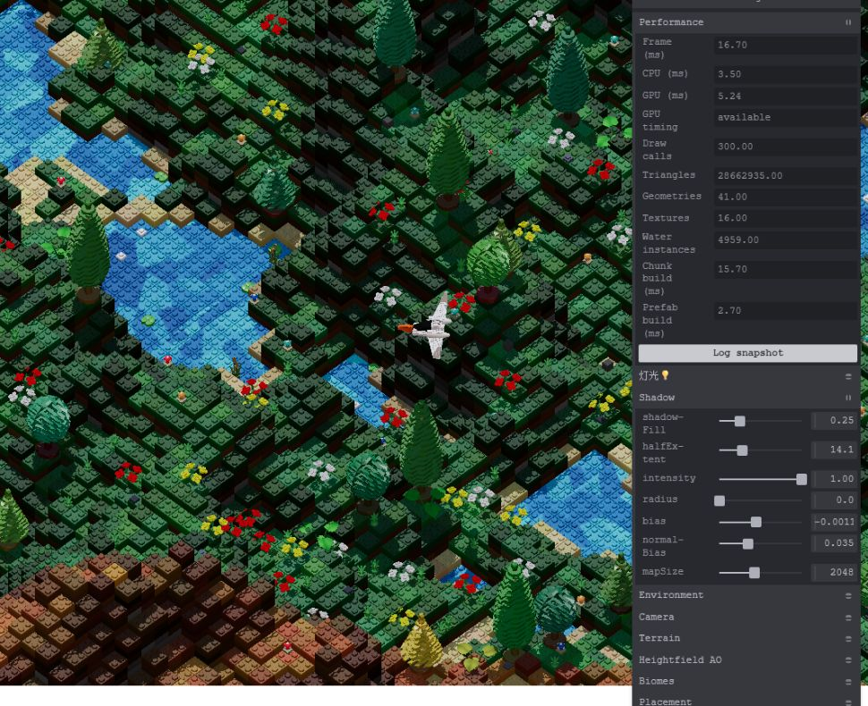

# 渲染与资源管理优化结果

日期：2026-10-08。基于 [架构评审文档](rendering-resource-architecture-review.md)，当前 Three.js 为 r185。默认 chunk 模式、后处理关闭、水面投影开启。

## 已实施的修改

| 评审项 | 实施结果 |
| --- | --- |
| D1 | 地形、熔岩、prefab 和水面在填充后更新包围球；已存在的包围盒也同步更新，实例颜色与矩阵同步标记更新。 |
| D2 | 只为可见范围内的 `isWater` 格子填充水面，复用固定容量的分页池，空页隐藏，恢复视锥裁剪。新增水面投影开关，默认保留投影。 |
| D3 | 新增 `WorldMaterials`，9 个 slot 共享 4 个地形/AO/水/熔岩材质；树、tint 和 instanceColor 材质缓存也由 World 持有。slot、placer 和预热对象借用材质，World 最后统一释放，调试面板修改共享材质。 |
| L1 | 预热关闭视锥裁剪并匹配投影设置，编译后实际渲染一帧。World 保留脱离场景的预热对象，保持未使用管线的缓存，在销毁时释放；异步预热被取消时释放晚到结果。 |
| L2–L5 | 砖块模型标记为必需资源，失败时抛出包含资源名的错误；可选资源保持降级。Environment 持有完整 PMREM 目标，生成后释放原始 HDR。Resources 去重释放 GLTF 几何体、材质、纹理和 ImageBitmap，处理销毁后的加载回调。World 释放克隆几何体，bootstrap 清理启动失败的 Experience。 |
| R1–R3 | 输出图切换设置 `needsUpdate`；统一销毁 ScenePass、GaussianBlur、两条 SMAA 分支及中间 RTT；顺序为线性 tone mapping、暗角、SMAA、最终 sRGB 转换，暗角强度重新校准，并保留原始 alpha，避免页面底色从四角透出。 |
| F1 | 推力发光分支克隆并管理自身材质，只缩放一次 `emissiveIntensity`，移除逐帧 `needsUpdate`。当前模型的引擎锚点没有可发光网格，实际可见推力仍由已有独立火焰 VFX 提供，未修改模型资产。 |
| F2、P1 | chunk 模式不再创建完整地图 renderer；`#debug` 新增 Performance 面板，分别记录 CPU、GPU、整帧绘制统计、启动阶段与 chunk/AO/prefab 构建耗时，并可输出 JSON 快照。GPU 查询仅在调试模式启用。 |

浏览器验证额外发现并修复了两项 r185 行为，兼容逻辑集中在 `src/renderer/installObjectResourceCleanup.js`：

1. `InstancedMesh.dispose()` 没有清理 WebGPU 的派生实例属性和借用材质的 RenderObject。重建场景曾每轮留下约 38 MB 实例属性。现在 mesh 销毁释放自身的实例 buffer、bindings 和管线，World 销毁还清理借用源材质的普通克隆对象，保留共享源几何体。
2. 小型实例池的矩阵 uniform 数组按首次绘制的 `count` 编译，缓存键没有随数量增加更新，水面换 chunk 后会缺块。现在节点编译使用 `instanceMatrix.count`（池容量），绘制仍使用实际 `mesh.count`。真实 WebGPU 检查验证了首次绘制 1 个、随后绘制 800 个实例时，shader 的矩阵数组容量保持 900。

## 性能对比

同一 Codex 内置浏览器，实际 CSS 视口 878 × 718，DPR 1.1，seed `20260608`，玩家固定在 `[12.8, 3, 12.8]`，9 个 chunk 加载完成后等待 5 秒，每 2 秒取样一次，共 7 次。优化前来自 HEAD 的独立源码副本，只添加相同统计方式和输入冻结。CPU、GPU 和帧间隔使用样本中位数。

| 指标 | 优化前 | 优化后 | 变化 |
| --- | ---: | ---: | ---: |
| 水面实例 | 46,656 | 8,160 | −82.5% |
| 水面 mesh | 54 | 13 | −75.9% |
| 地形同类材质 | 9 | 1 | slot 共用 |
| 整帧 draw call | 372 | 280 | −24.7% |
| 整帧三角形 | 43,594,711 | 28,317,791 | −35.0% |
| CPU 帧工作 | 6.00 ms | 3.50 ms | −41.7% |
| GPU 时间 | 6.03 ms | 5.44 ms | −9.8% |
| 帧间隔 | 16.70 ms | 16.70 ms | 约 60 FPS |
| renderer 统计内存 | 122,816,890 B | 111,771,649 B | −9.0% |

三角形和 draw call 包含主场景、阴影等整帧 pass。内存是 Three 的资源估算，GPU 时间是本机短时采样；这些结果没有证明更高帧率或所有设备上的同等收益。扩大预热覆盖会保留更多已准备资源，几何体和纹理数量不能单独代表泄漏。

原始数据：[性能样本](rendering-optimization-metrics.json)。一次启动中，预热约 3.22 秒，总初始化约 3.42 秒；预热将编译工作前移，仍有启动等待成本。

关闭水面投影的同场景检查进一步将 draw call 从 280 降至 267、三角形从 28,317,791 降至 26,914,271。保留默认投影，以维持当前水面砖块的立体表现，可在 Materials 中按画面需求选择。[阴影开关数据](rendering-optimization-water-shadows.json)

## 验证记录

- `pnpm build` 通过；Vite 仍提示主 bundle 超过 500 kB。
- 新增 27 项回归测试，覆盖实例包围体、实例池容量、共享材质、缓存隔离、资源去重释放、晚到回调、启动失败、异步取消和后处理销毁。
- 完整 `pnpm test`：213 项，203 通过，10 失败。改动前为 186 项，176 通过，同样 10 失败。已有失败分布为 `aircraftInput` 3 项、`environmentShadowFollow` 1 项、`prefabInstanceColorConfig` 2 项、TiltShift 默认值/范围 2 项、`worldCameraFollow` 2 项；本轮未修改这些既有行为和断言。
- 真实飞行路径为 W 16 秒、A 0.8 秒、W 12 秒，覆盖约 57 次 chunk 构建，最终从中心 `[0, 0]` 到 `[4, 4]`，9 个 slot 保持加载。复查了海岸线、高地、边缘 prefab、森林到秋季森林的过渡和原先水面缺块的位置。[飞行快照](rendering-optimization-flight.json)
- 五轮 World 创建、实际渲染与销毁，每次在 renderer 仍存活时采样，回到相同资源基线：80 个属性、1,930,356 B 属性数据、4 个 uniform buffer、4 个程序、38 个几何体、15 张纹理和 3 个渲染目标。此时 Resources 和 Environment 继续持有所需源资产及环境贴图。Experience 销毁再释放这些使用者，renderer 最后销毁自身内部资源。[生命周期数据](rendering-optimization-lifecycle.json)
- 后处理首帧后切换输出图、实际绘制并重新 attach，通过检查；原图拥有的 12 个渲染目标全部释放。暗角保留 alpha 后不再透出页面底色，TiltShift 关闭后画面恢复清晰。[后处理切换画面](rendering-optimization-postprocessing.jpg) 必需砖块模型加载失败完成清理，可选水面噪声纹理失败后 9 个 chunk 正常启动。

可复跑的浏览器检查：启动 `pnpm dev`，打开 `/dev/rendering-validation.html#debug`，点击 **Run rendering checks**。它验证实际 WGSL 数组容量、五轮 World 清理、后处理切换/重新挂载及加载失败清理；会故意请求两个缺失资源，相应控制台错误属于测试预期。

## 后续测量重点

本次飞行的 chunk 构建最大值约 26.2 ms，超过 60 Hz 的单帧预算。Performance 面板已分别记录生成、placement、AO 和实例填充耗时，可据此开展分帧构建或 Worker 优化。当前验证覆盖一条飞行路线和本机 WebGPU，长时间飞行、全部 biome 的首次进入以及不同 GPU 的高分位帧耗时还需要专门的压力测试。

升级 Three 时，重新运行浏览器检查页：对象资源清理、固定矩阵数组容量和中间 RTT 释放依赖已核实的 r185 内部实现。

